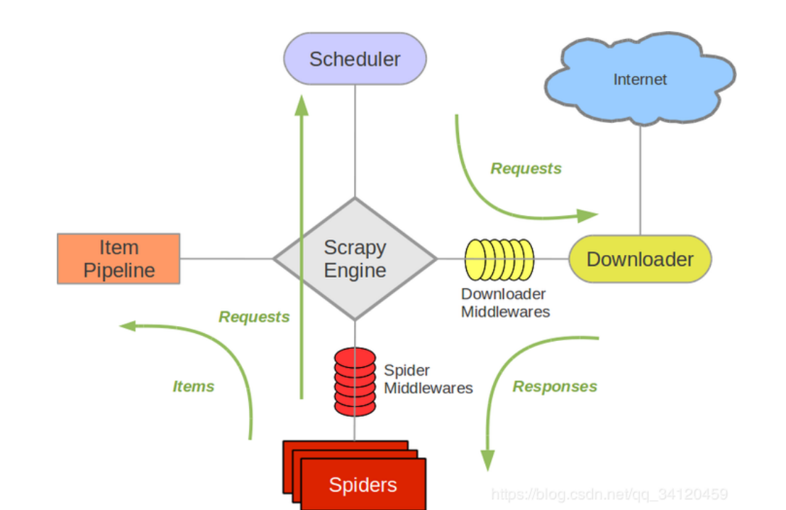

# Scrapy 使用教程

## 基本操作步骤

### 1. 创建爬虫项目
```bash
scrapy startproject 项目的名字
```
**注意**：项目的名字不允许使用数字开头，也不能包含中文

### 2. 创建爬虫文件
需要在 spiders 文件夹中创建爬虫文件：
```bash
# 进入 spiders 目录
cd 项目的名字\项目的名字\spiders

# 示例
cd scrapy_baidu\scrapy_baidu\spiders

# 创建爬虫文件
scrapy genspider 爬虫文件的名字 要爬取网页

# 示例
scrapy genspider baidu www.baidu.com
```
**注意**：一般情况下不需要添加 http 协议，因为 start_urls 的值是根据 allowed_domains 修改的。如果添加了 http，那么 start_urls 就需要手动修改。

### 3. 运行爬虫代码
```bash
scrapy crawl 爬虫的名字

# 示例
scrapy crawl baidu
```
**注意**：应在 spiders 文件夹内执行

## 项目结构

```
项目名称/
├── spiders/
│   ├── __init__.py
│   └── 自定义爬虫.py    # 核心爬取逻辑
├── __init__.py
├── items.py          # 数据结构定义
├── middlewares.py    # 代理/IP轮换
├── pipelines.py      # 数据管道处理
└── settings.py       # 全局配置
```

## Scrapy 架构组成

1. **引擎 (Engine)**：自动运行，无需关注，会自动组织所有的请求对象，分发给下载器
2. **下载器 (Downloader)**：从引擎处获取到请求对象后，请求数据
3. **爬虫 (Spider)**：Spider 类定义了如何爬取某个(或某些)网站。包括了爬取的动作(例如：是否跟进链接)以及如何从网页的内容中提取结构化数据(爬取 item)
4. **调度器 (Scheduler)**：有自己的调度规则，无需关注
5. **项目管道（Item pipeline）**：最终处理数据的管道，会预留接口供我们处理数据

### Item Pipeline 的典型应用

当 Item 在 Spider 中被收集之后，它将会被传递到 Item Pipeline，一些组件会按照一定的顺序执行对 Item 的处理。每个 item pipeline 组件是实现了简单方法的 Python 类。主要用途包括：

- 清理 HTML 数据
- 验证爬取的数据(检查 item 包含某些字段)
- 查重(并丢弃)
- 将爬取结果保存到数据库中


## 工作流程


### 1. 启动爬虫  
- 用户运行爬虫时，引擎调用 `Spider` 的 `start_requests()` 方法生成初始请求。

---

### 2. 请求入队  
- 引擎将请求交给**调度器**排队，调度器根据策略（如深度优先、广度优先）调度请求。

---

### 3. 下载页面  
- 调度器将请求交给**下载器**，下载器通过异步网络库（如 Twisted）发送请求，获取响应。

---

### 4. 解析响应  
下载器将响应返回引擎，引擎将响应传递给 `Spider` 的 `parse()` 方法：  
- **提取数据**：生成 `Item` 对象（结构化数据）。  
- **生成新请求**：通过 `yield Request` 继续爬取其他页面。

---

### 5. 数据处理  
- 提取的 `Item` 进入**管道**，依次经过清洗、去重、存储等处理（如存入 CSV 或数据库）。

---

### 6. 循环执行  
- 新生成的请求会重新进入调度器队列，重复上述流程，直到请求队列为空。


## 常用命令速查表

| 命令 | 说明 | 示例 |
|------|------|------|
| scrapy startproject | 创建项目 | `scrapy startproject news_crawler` |
| scrapy genspider | 生成爬虫 | `scrapy genspider news news.cn` |
| scrapy genspider -t crawl | 生成爬虫模板 | `scrapy genspider -t crawl news news.cn` |
| scrapy list | 列出项目 | `scrapy list` |
| scrapy crawl | 运行爬虫 | `scrapy crawl news -o results.csv` |
| scrapy shell | 调试模式 | `scrapy shell https://example.com` |
| scrapy check | 项目检查 | `scrapy check -v` |

### 注意:生成爬虫文件中
需要先切换到项目目录的spiders文件夹下执行;  
模板**basic**主要用于处理简单的单页面或少量页面爬取任务,**crawl**主要用于处理复杂的多页面爬取任务，需要自动跟进链接
    

## scrapy调试
直接在终端中运行 scrapy shell 命令
```bash
scrapy shell www.baidu.com  # 示例
```

## 代理的使用
- （1）到settings.py中，打开一个选项
```bash
DOWNLOADER_MIDDLEWARES = {
'postproject.middlewares.Proxy': 543,}
```
- （2）到middlewares.py中写代码
```bash
def process_request(self, request, spider):
    request.meta['proxy'] = 'https://113.68.202.10:9999'
    return None
```

## 补充：CrawlSpider
在scrapy调试中，可以使用CrawlSpider来调试爬虫，CrawlSpider是一个特殊的Spider，它提供了一些辅助方法，可以方便的调试爬虫。

### CrawlSpider用法
先导入LinkExtractor（集成CrawlSpider）
```bash
from scrapy.linkextractors import LinkExtractor
```
```bash
# LinkExtractor的主要参数：
    LinkExtractor(
        allow, # 正则表达式 提取符合正则的链接
        restrict_xpaths, # xpath，提取符合xpath规则的链接
        restrict_css # 提取符合选择器规则的链接（不推荐）
        )
```
```bash
# 提取链接
link.extract_links(response)
```
